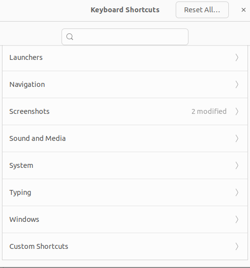
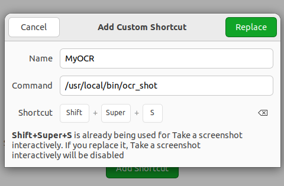
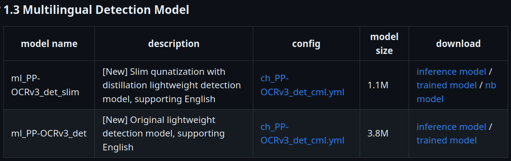
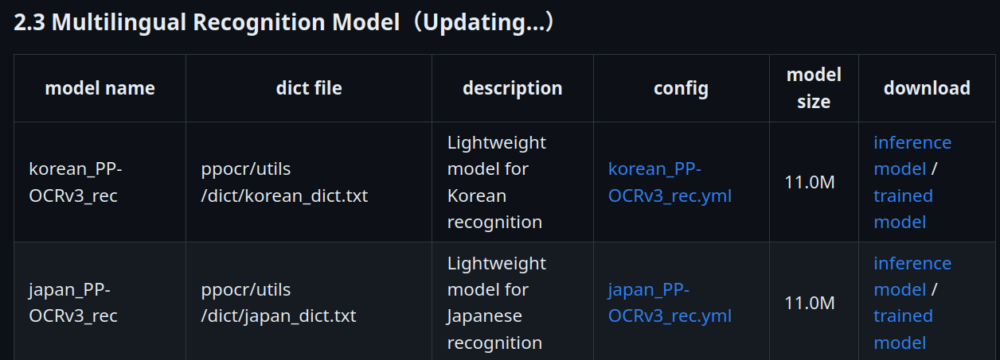

### [demo video](https://drive.google.com/file/d/1-hgTDnwWRqIFXItQzUt-WLcEGQymZG9P/preview)


https://github.com/EltonLab/ocr_desktop_ubuntu/assets/143599700/97d7b5ed-f9cb-4e47-b312-552a324f364c


I made a simple gui for [PaddleOCR](https://github.com/PaddlePaddle/PaddleOCR/tree/release/2.7), most of the code are just from their repo           
       
### project setup
to run this project you'll need to download the paddleOCR or paddleOCR-gpu deep learning framework,  

```sh
pip install -r requirements.txt 
### paddle paddle is the deep learning framework this repo used
# if you have gpu
python -m pip install paddlepaddle-gpu -i https://pypi.tuna.tsinghua.edu.cn/simple
# if you dont have gpu
python -m pip install paddlepaddle -i https://pypi.tuna.tsinghua.edu.cn/simple
```
#### trouble shoot
here is some problem I've encounter when trying to install paddlepaddle, and the solutions for these problems have been answered in these link.     
[ImportError: libssl.so.1.1: cannot open shared object file: No such file or directory](https://stackoverflow.com/questions/72133316/libssl-so-1-1-cannot-open-shared-object-file-no-such-file-or-directory)  
[ImportError: libcudart.so.10.2: cannot open shared object file: No such file or directory](https://github.com/PaddlePaddle/PaddleOCR/issues/10324)  
[FatalError: Segmentation fault](https://github.com/PaddlePaddle/PaddleOCR/issues/10014)
[AttributeError: 'FreeTypeFont' object has no attribute 'getsize'](https://github.com/tensorflow/models/issues/11040)


### run the model
#### gui
to run ocr with gui, type the following in your command line
```sh
python ocr_shot3.py
```
ocr_shot3 will then call predict_system3.py, the default args for the model is in ./arg.py

#### cmd
If you want to debug using cmd
just type 
```sh
pip install fire    #useful command line tool
python predict_system3.py --mode en
python predict_system3.py --mode jp
python predict_system3.py --mode ch
```

### run this app using keyboard shortcut
currently only tested on linux/ubuntu22.04,    
for other distro, checkout [flameshot's setup guide](https://github.com/flameshot-org/flameshot#global)
##  set up on ubuntu
#### 1. copy the execute file to /usr/local/bin
```sh
$ pwd
/path/to/this/OCR_ScreenShot
$ sudo ln -s /path/to/this/OCR_ScreenShot_folder /usr/local
$ chmod +x ./ocr_shot
$ sudo cp ./ocr_shot /usr/local/bin
$ ocr_shot
# now you can ocr_shot in command line everywhere
```

go to   
setting/keyboard/View and Customize Shortcuts   
scroll down and click Custom Shortcuts   


click "Add shortcut"     
and set to any keyboard shortcut you like
     



### download the weights from official website
weights are already in the download folder, but sometimes you will want to download other language from the official website.  
model are all download from [this page (en)](https://github.com/PaddlePaddle/PaddleOCR/blob/release/2.7/doc/doc_en/models_list_en.md) or [this page (zh)](https://github.com/PaddlePaddle/PaddleOCR/blob/release/2.7/doc/doc_ch/models_list.md)      
basically, you just need to download the detection model, and recognition model with the language you want to use, and then put it into the ``./model`` directory          
#### detection model
one thing to note is that sometimes you don't need to download every detection model, for example the chinise detection model can also detect english sentence (performance might drop a little bit, but it's doesn't )
##### [chinese detection model](https://github.com/PaddlePaddle/PaddleOCR/blob/release/2.7/doc/doc_en/models_list_en.md#1-chinese-detection-model)
make sure to download the inference model, not the train model.
and the chinese detection model version should be v3
##### [english detection model](https://github.com/PaddlePaddle/PaddleOCR/blob/release/2.7/doc/doc_en/models_list_en.md#12-english-detection-model)
english detection model version should be v3
##### [Multilingual detection (japanese/korean/....)](https://github.com/PaddlePaddle/PaddleOCR/blob/release/2.7/doc/doc_en/models_list_en.md#13-multilingual-detection-model)   
   
Multilingual detection model version should be v3

#### recognition model
##### [chinese recognition](https://github.com/PaddlePaddle/PaddleOCR/blob/release/2.7/doc/doc_en/models_list_en.md#21-chinese-recognition-model)   
you can download either v4 or v3, make sure to download the inference model, not the train model   
##### [english recognition](https://github.com/PaddlePaddle/PaddleOCR/blob/release/2.7/doc/doc_en/models_list_en.md#22-english-recognition-model)   
you can download either v4 or v3  
##### [Multilingual Recognition (japanese/korean/....)](https://github.com/PaddlePaddle/PaddleOCR/blob/release/2.7/doc/doc_en/models_list_en.md#23-multilingual-recognition-modelupdating)
   
japanese recognition model should be v3     
